# Sơ đồ Kiến trúc GraphRAG

## 1. Tổng quan Hệ thống

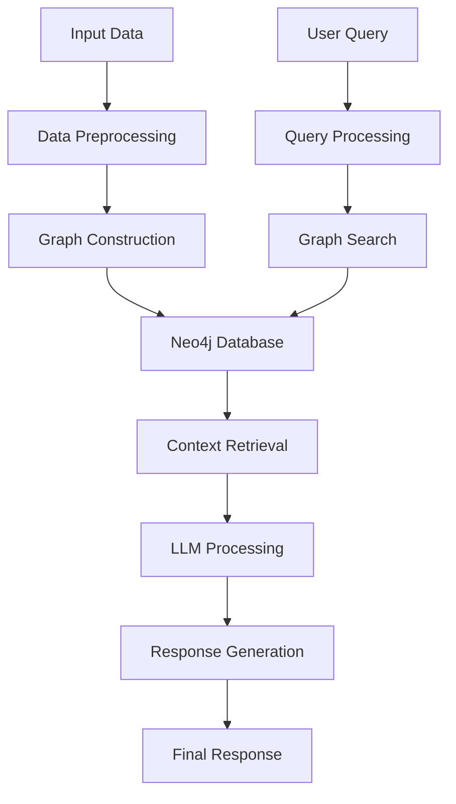

## 2. Chi tiết Các Thành phần

### 2.1. Data Processing Pipeline

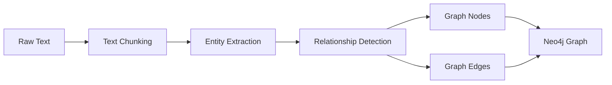

### 2.2. Query Processing Flow

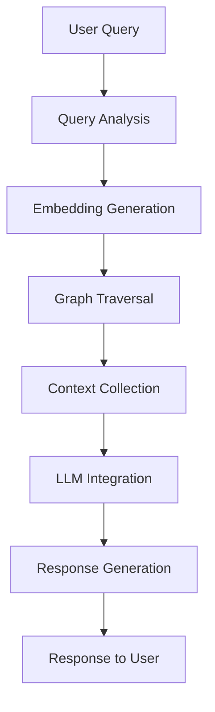

### 2.3. System Components

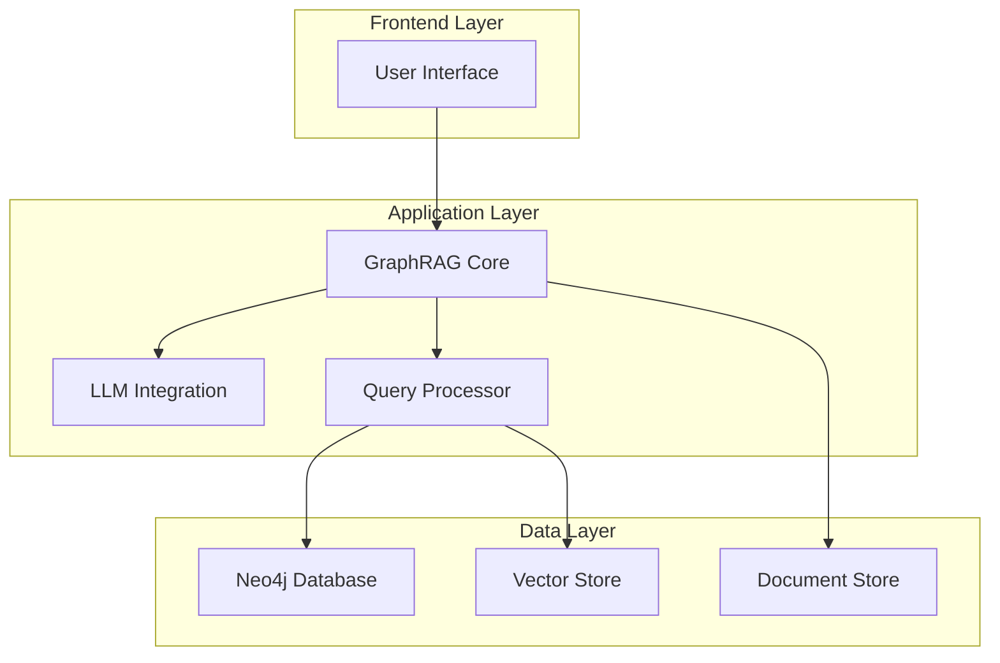

## 3. Luồng Dữ liệu

### 3.1. Data Ingestion Flow

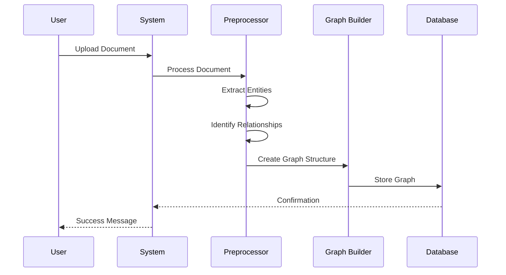

### 3.2. Query Processing Flow

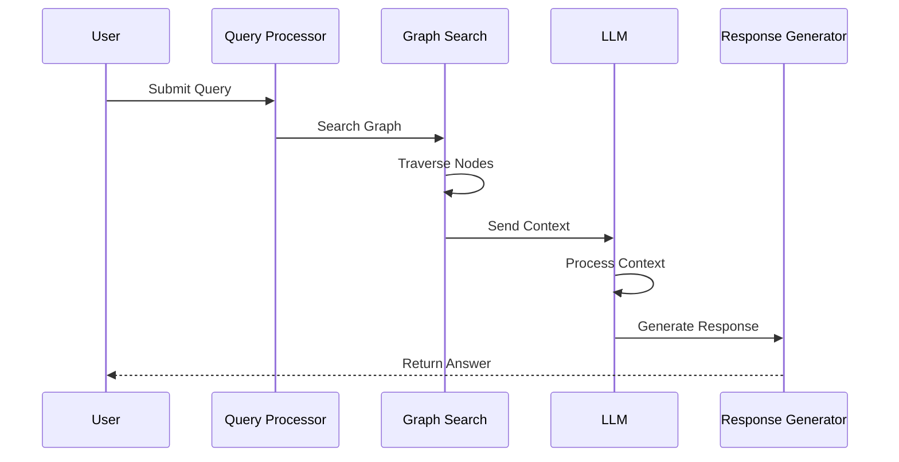

## 4. Các Module Chính

### 4.1. GraphRAG Core Module

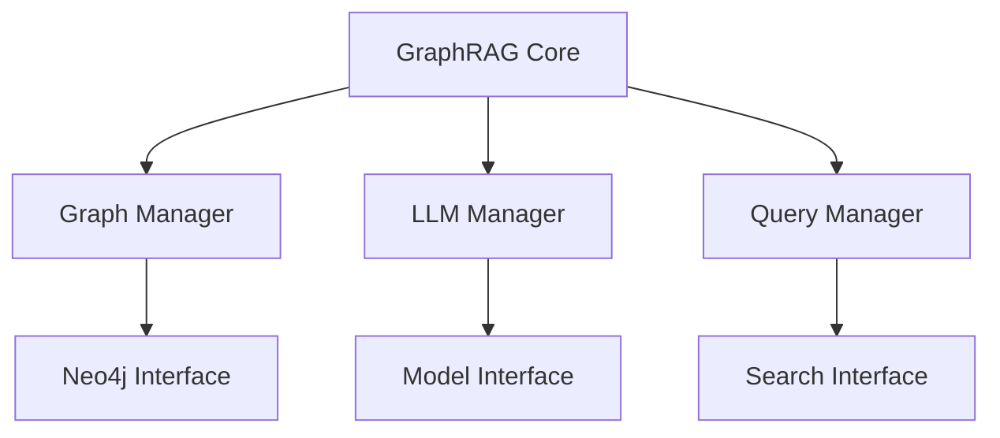

### 4.2. Data Management Module

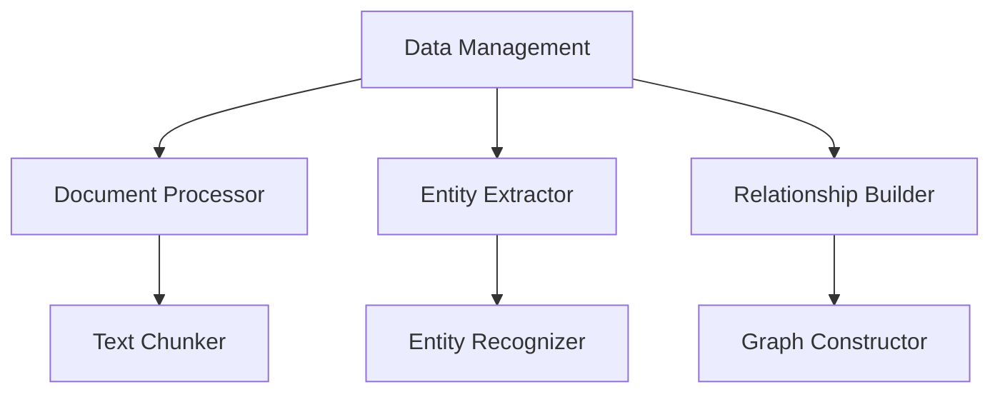

## 5. Các API Endpoints

```mermaid
graph LR
    A[API Gateway] --> B[/ingest]
    A --> C[/query]
    A --> D[/graph]
    A --> E[/status]
    B --> F[Document Ingestion]
    C --> G[Query Processing]
    D --> H[Graph Operations]
    E --> I[System Status]
```

## 6. Monitoring và Logging

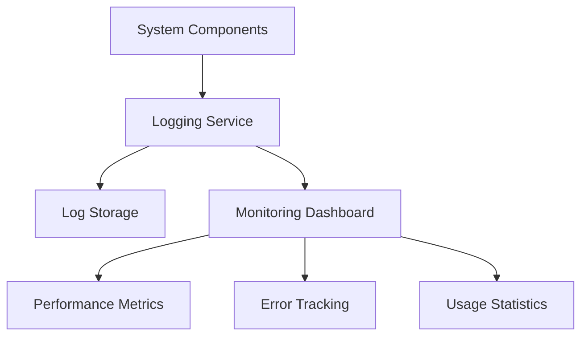

## 7. Security Layer

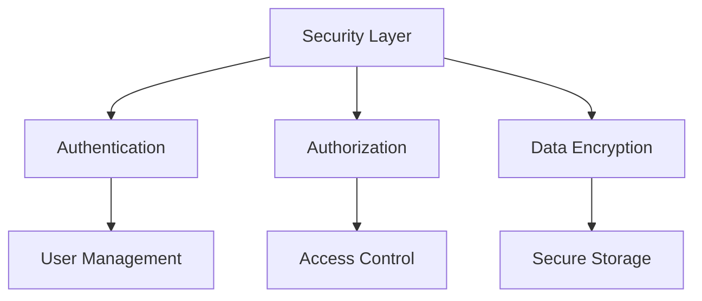

## 8. Deployment Architecture

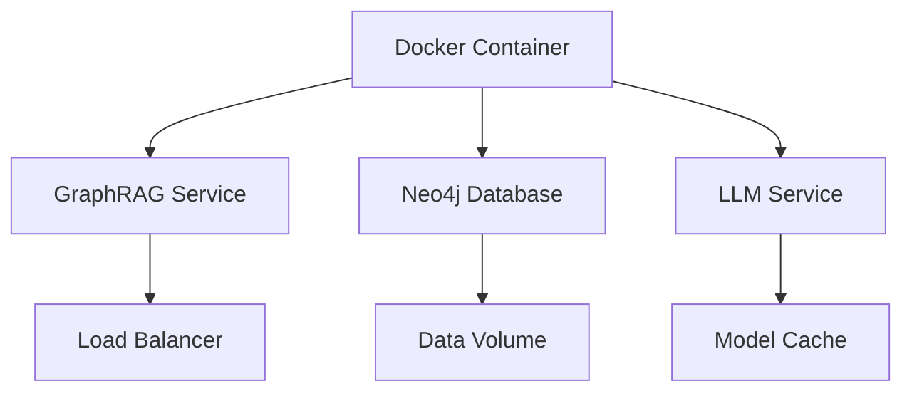

## 9. Error Handling

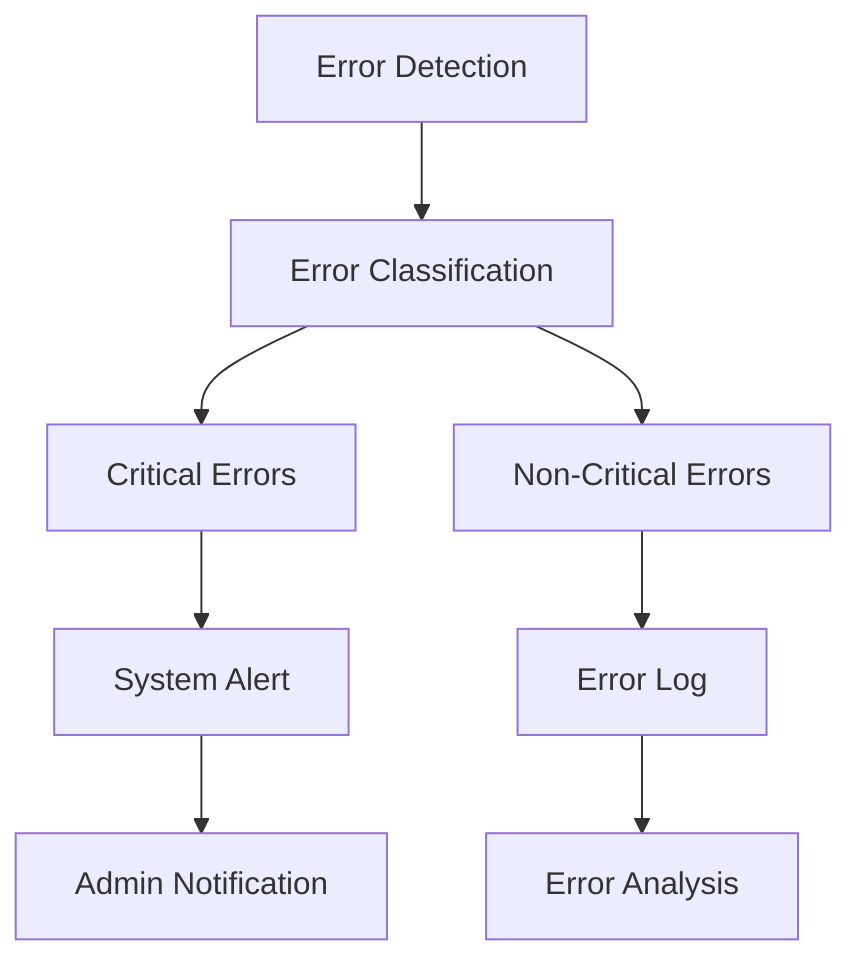

## 10. Performance Optimization

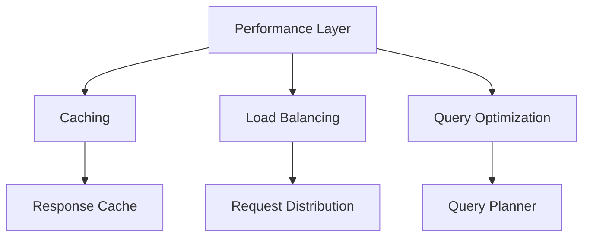